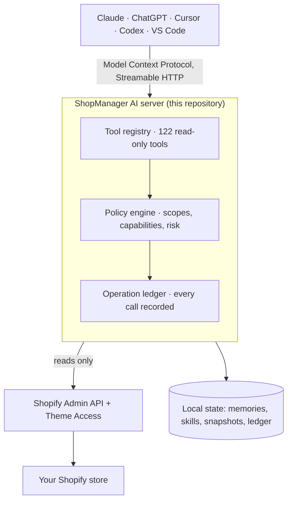

# Shopify MCP Server - ShopManager AI (Free, Open Source, Read-Only)

**ShopManager AI is a free, open-source Shopify MCP server for safe, read-only
access to a real Shopify store from Claude Code, ChatGPT, Cursor, Codex, VS Code
and compatible MCP clients.** It exposes 122 tools across the Shopify Admin API,
themes, Liquid, products, collections, content, store configuration, Theme Check
and diagnostics, with self-hosting and an Apache-2.0 license.

[](https://github.com/shopmanagerai/shopify-mcp/actions/workflows/ci.yml)
[](LICENSE)
[](package.json)
[](docs/tools.md)
[](#read-only-shopify-mcp-guarantee)



Everything reaching Shopify is a read. The only things this server writes are
its own local state and its own access.

> ### Two ways to use the free tools
>
> **Hosted, no setup.** Sign up free at
> **[shopmanagerai.com/free](https://shopmanagerai.com/free/)**, connect your
> store in the browser, and paste one line into your AI client. No server, no
> Node, no terminal, and the same tools you see here.
>
> **Self-hosted, this repository.** Clone it and run it yourself, with your
> store's data staying entirely on your own infrastructure.
>
> Both are free. Pick whichever you prefer; you are not missing tools by
> choosing the hosted one.

---

## Contents

- [Why this project exists](#why-this-project-exists)
- [Quick start](#quick-start)
- [Shopify MCP server features](#shopify-mcp-server-features)
- [Shopify's official MCP servers vs ShopManager AI](#shopifys-official-mcp-servers-vs-shopmanager-ai)
- [Read-only Shopify MCP guarantee](#read-only-shopify-mcp-guarantee)
- [Connect your Shopify store](#connect-your-shopify-store)
- [Connect Claude, ChatGPT, Cursor, Codex and VS Code](#connect-claude-chatgpt-cursor-codex-and-vs-code)
- [Tutorial: your first session](#tutorial-your-first-session)
- [122 Shopify MCP tools](#122-shopify-mcp-tools)
- [Free vs Pro](#free-vs-pro)
- [Self-host Shopify MCP with Docker](#self-host-shopify-mcp-with-docker)
- [Security](#security)
- [Troubleshooting](#troubleshooting)
- [FAQ](#faq)

---

## Why this project exists

A general AI coding assistant knows Shopify as a concept. It does not know
*your* store. Ask it which snippet renders your product card and it will guess,
usually plausibly and usually wrong, because it has never seen your theme.

This server gives the assistant the real thing, read-only, so questions like
these get answered from source rather than from memory:

- Which templates and sections actually render `snippets/product-card.liquid`?
- Which theme file contains the section that broke the cart drawer?
- Which collections and pages have no SEO title or description?
- Which Shopify scopes am I missing, and what is failing because of it?
- What does Theme Check flag on the live theme, and why does it matter?
- What changed between my working theme and the published one?

## Quick start

Node 22+ and pnpm. Want [Docker](#self-host-shopify-mcp-with-docker) instead? That works
too.

```bash
git clone https://github.com/shopmanagerai/shopify-mcp.git
cd shopify-mcp
pnpm install
pnpm build
cp .env.example .env
```

Set `SHOPMANAGER_DEMO=1` in `.env` and run `pnpm start`. That serves a complete
fake store, so you can see every tool work before creating a Shopify app:

```
======================================================================
 ShopManager AI, DEMO MODE
 Serving a single fake store: demo.myshopify.com
 Admin UI:  http://localhost:3000/admin?shop=demo.myshopify.com
 MCP URL:   http://localhost:3000/mcp/demo.myshopify.com
======================================================================
```

Connect Claude Code, using the demo bearer token `cp_demo`:

```bash
claude mcp add --transport http shopmanager http://localhost:3000/mcp/demo.myshopify.com --header "Authorization: Bearer cp_demo"
```

Then ask: *"Inspect this Shopify store and tell me the store name, the active
theme and the number of products."*

When that works, [connect a real store](#connect-your-shopify-store). Demo mode
is a convenience, not a limitation.

## Shopify MCP server features

- **Read the theme like source code.** File tree by role, every section and
  block schema, Liquid parsing and validation, search across the theme, and
  reference tracing.
- **Run Theme Check** and have each issue explained rather than just listed.
- **Read the catalog and content**: products, variants, collections, pages,
  blogs, articles, menus, metafields, metaobjects, media, redirects.
- **Read store configuration**: markets, locales, translations, price lists,
  discounts, inventory, locations, webhooks, pixels, script tags, functions,
  checkout profiles.
- **Diagnose the connection**: which scopes are granted, which capabilities are
  missing, and what to do about each one.
- **Remember things between sessions** with saved memories and custom skills.

Good for understanding a theme you inherited, auditing a store before a
migration, and giving an assistant accurate context before you ask it to write
any code.

In practical terms, this repository acts as a **read-only Shopify Admin MCP** and
**Shopify theme/Liquid MCP**: the assistant can inspect the merchant's actual Admin data and theme source without exposing Shopify mutation tools.

## Shopify's official MCP servers vs ShopManager AI

Shopify ships several official MCP and UCP surfaces. They solve different
problems from this project and can be used together. Verified September 2026;
full detail with primary sources is in
**[Shopify official MCP vs ShopManager AI](docs/shopify-official-mcp-vs-shopmanager.md)**.

| MCP / surface | Primary user | Primary job | Actual store/theme context | Shopper commerce | Shopify writes |
| --- | --- | --- | --- | --- | --- |
| [Shopify Dev MCP](https://shopify.dev/docs/apps/build/devmcp) | Developers | Shopify docs, API schemas and development validation | Development/schema context, not merchant-store inspection | No | Development-oriented |
| [Storefront MCP / UCP Catalog](https://shopify.dev/docs/apps/build/storefront-mcp/servers/storefront) | Shopper-facing agents | Product discovery and store policies for one merchant | Storefront/catalog context | Yes | No merchant-admin writes |
| [Cart MCP](https://shopify.dev/docs/agents/carts-and-checkout/cart-mcp) | Shopper-facing agents | Create, read, update and cancel carts through UCP | Buyer/cart context | **Yes** | Shopper cart operations |
| [Checkout MCP](https://shopify.dev/docs/agents/carts-and-checkout/checkout-mcp) | Shopper-facing agents | Create/manage checkout sessions and complete purchases where supported | Buyer/checkout context | **Yes** | Shopper checkout operations |
| [Order MCP](https://shopify.dev/docs/agents/orders/order-mcp) | Shopper-facing agents | Read supported order information through UCP | Buyer/order context | **Yes** | Order actions as supported by Shopify |
| [Customer Accounts MCP](https://shopify.dev/docs/apps/build/storefront-mcp/servers/customer-account) | Authenticated shoppers | Customer account, order and return workflows | Customer-scoped context | **Yes** | Supported customer actions |
| [WebMCP](https://shopify.dev/docs/api/web-mcp) | Browser agents | Structured interaction with a shopper's live storefront session | Browser/storefront context | **Yes** | Session commerce actions |
| **ShopManager AI Free** | Merchants, developers, agencies | Inspect the actual connected Shopify store, Admin data, theme source, Liquid and diagnostics | **Yes** | Not its primary purpose | **No Shopify content/theme writes** |
| **ShopManager AI Pro** | Merchants, developers, agencies | Governed store operations, theme work, SEO/AEO, visual QA and automation | **Yes** | Not its primary purpose | **Yes, with policy and approval** |

> **2026 UCP note:** Shopify deprecated the old Storefront MCP cart tools in
> favour of UCP Cart MCP. Shopify storefronts now advertise UCP `2026-08-25` in
> discovery profiles, so current agentic-commerce integrations should follow the
> latest Shopify UCP documentation rather than older cart examples.

**Which should I use?**

- **Shopify Dev MCP** for Shopify development knowledge: documentation, GraphQL
  schemas, and validating Shopify code as you build.
- **Storefront/UCP Catalog MCP** for shopper-facing product discovery and store
  policy questions.
- **Cart, Checkout and Order MCP** for UCP shopper-commerce workflows.
- **Customer Accounts MCP** when an authenticated shopper needs account, order
  or return functionality.
- **WebMCP** when the agent operates in the shopper's browser on a live storefront.
- **ShopManager AI Free** when Claude Code, ChatGPT, Cursor, Codex or another
  compatible MCP client needs controlled, read-only context from the merchant's
  actual Shopify Admin data and theme source.
- **ShopManager AI Pro** when approved store changes, theme editing, SEO/AEO,
  visual QA or larger automation workflows need to be applied.
- **Shopify Dev MCP + ShopManager AI** when you are coding against Shopify APIs
  while inspecting the real store you are coding for. Dev MCP answers
  "how should this be done?"; ShopManager AI answers "what is actually there?".

> ShopManager AI is an independent product and open-source project. It is not an
> official Shopify product and is not endorsed by or affiliated with Shopify.

## Read-only Shopify MCP guarantee

This build cannot change your store. That is enforced, not promised.

- **No tool writes to Shopify.** Not a theme file, product, collection, page,
  article, menu, metafield, order or customer.
- **It asks for read-only permissions.** Every Shopify scope it requests is a
  `read_*` scope, and the list is generated from what the shipped tools declare,
  so it cannot quietly grow.
- **The few tools that write, write here.** Memories, skills, snapshots and the
  operation ledger live in your own database. Two tools reach Shopify to change
  something narrow: `shopify.auth.disconnect` (revokes this server's own access)
  and `commerce.settings.storefront_password`.
- **Tools declare themselves to your client** through MCP annotations
  (`readOnlyHint`, `destructiveHint`, `idempotentHint`, `openWorldHint`),
  derived from each tool's own metadata rather than asserted by hand.

CI runs [`scripts/assert-free-only.mjs`](scripts/assert-free-only.mjs) against
the registry the server actually builds:

```
OK: 122 tools, all Free.
    0 write to a Shopify store's content or theme.
    7 write only to this server's own state or its own access.
    17 Shopify scopes requested, all read-only.
```

If a tool ever declares a Shopify write, or `.env.example` requests a write
scope, the build fails. [SECURITY.md](SECURITY.md) has the threat model,
including what a Theme Access credential can really do.

## Connect your Shopify store

1. **Create an app** in the [Shopify Dev Dashboard](https://shopify.dev) for the
   store you want to connect, and copy its client ID and secret.

2. **Fill in `.env`:**

   ```bash
   SHOPMANAGER_DEMO=0
   SHOPIFY_CLIENT_ID=your-client-id
   SHOPIFY_CLIENT_SECRET=your-client-secret
   APP_URL=https://your-public-url
   ```

   `APP_URL` must be reachable by Shopify for the OAuth callback. A tunnel such
   as `cloudflared` or `ngrok` works in development. Set the same URL as the
   app's redirect URL. `SHOPIFY_SCOPES` is already filled in with the read-only
   set.

3. **Start the server** and open
   `http://<APP_URL>/admin?shop=<your-store>.myshopify.com`.

4. **Approve the install** in the Shopify admin when prompted.

5. **Add a Theme Access password** in the admin UI. Theme file reads go through
   Shopify's Theme Access proxy, and theme tools report `capability_missing`
   until this is set.

   > A Theme Access password issued by Shopify carries `write_themes` capability
   > at the Shopify credential level. This build ships no theme mutation tool
   > and enforces read-only theme behaviour in its policy layer, but the
   > credential itself is more powerful than the use made of it here. It is
   > encrypted at rest, never returned by a tool, and revocable at any time.
   > See [SECURITY.md](SECURITY.md).

6. **Create a token** in the **Connect** screen. That is the `<TOKEN>` your AI
   client sends.

## Connect Claude, ChatGPT, Cursor, Codex and VS Code

Every client talks to the same URL, `http://<host>/mcp/<shop>`, over Streamable
HTTP with a bearer token.

| Client | Status | Guide |
| --- | --- | --- |
| Claude Code | Verified | [Connect Claude Code to Shopify with MCP](docs/claude-code.md) |
| Cursor | Configuration documented | [Connect Cursor to Shopify with MCP](docs/cursor.md) |
| VS Code | Configuration documented | [Connect VS Code to Shopify with MCP](docs/vscode.md) |
| Codex | Configuration documented | [Connect Codex to Shopify with MCP](docs/codex.md) |
| ChatGPT | Depends on plan and developer mode | [Connect ChatGPT to Shopify with MCP](docs/chatgpt.md) |
| Other MCP clients | Works where the client supports the transport | [Connect any compatible MCP client](docs/generic-mcp.md) |

*Verified* means tool calls have been run end to end over that transport.
*Configuration documented* means the config shape matches the client's
documented format. Last checked September 2026.

**Keeping the client's context small.** By default the server advertises three
meta-tools, `discover-tools`, `get-schema` and `execute-tool`, rather than all
122. Append `?surface=flat` to the URL to advertise every tool
directly.

## Tutorial: your first session

Run these in order the first time you connect a store. All read-only.

**1. Confirm you are pointed at the right store**

> Inspect my Shopify store and tell me the store name, the active theme and the
> number of products. Do not make any changes.

The store name in the reply is the check.

**2. Find out what the connection can actually do**

> List the available tools for this store, grouped by whether they are
> available, missing a scope, or missing a capability. For anything
> unavailable, show the exact reason.

**3. Get oriented in the theme**

> Show me the architecture of the active theme: templates, sections, blocks,
> snippets and assets, with file counts per group.

**4. Ask something you could not answer from the admin**

> Which templates and sections actually render `snippets/product-card.liquid`?
> Show the reference chain.

This traces real `render` and `include` calls across the theme.

**5. Check the theme for real problems**

> Run Theme Check on the active theme, summarise the issues by severity, then
> explain the three most serious ones and what causes them.

**6. Look for content gaps**

> List my collections and pages, and tell me which have no description or no
> SEO title.

**7. Remember what you learned**

> Save a memory: this store uses a Dawn-based theme, the cart drawer lives in
> `snippets/cart-drawer.liquid`, and product cards come from
> `snippets/product-card.liquid`.

More prompts, grouped by task, are in the
[prompt library](https://shopmanagerai.com/resources/shopify-ai-prompts/).

## 122 Shopify MCP tools

122 tools across 9 categories.
**[Browse all Shopify MCP tools](docs/tools.md)**, or read
[`tools-manifest.json`](tools-manifest.json) for the machine-readable version
with input and output schemas, required scopes, risk class and data categories.

| Area | Tools | Examples |
| --- | ---: | --- |
| Theme inspection, files and Theme Check | 23 | `shopify.theme.architecture`, `shopify.theme.assets`, `shopify.theme.blocks` |
| Catalog and content | 19 | `shopify.product.get`, `shopify.products.list`, `shopify.publications.list` |
| Store configuration and commerce | 19 | `shopify.catalogs.list`, `shopify.markets.get`, `shopify.markets.list` |
| System, health and diagnostics | 17 | `commerce.api.capabilities`, `commerce.capabilities`, `commerce.config.get` |
| Change planning, ledger and export | 11 | `commerce.change.apply`, `commerce.change.diff`, `commerce.change.plan` |
| Memory and skills | 11 | `commerce.memory.delete`, `commerce.memory.get`, `commerce.memory.list` |
| Sections, blocks, templates and Liquid | 9 | `shopify.block.inspect`, `shopify.block.schema`, `shopify.section.inspect` |
| Auth and capability probes | 7 | `shopify.auth.connect`, `shopify.auth.disconnect`, `shopify.auth.doctor` |
| Snapshots | 6 | `commerce.rollback.plan`, `commerce.rollback.verify`, `commerce.snapshot.create` |

### A note on `commerce.change.*`

These tools plan, validate and apply a change by delegating to another
registered tool under the same policy pipeline. In this build there is nothing
store-mutating to delegate to: asking `commerce.change.apply` for a Pro tool
returns `TOOL_NOT_FOUND`, because that tool is not in the registry. The facade
is here because plan and diff are useful on their own.

## Free vs Pro

Everything here is Free and always will be. Free reads; it does not change the
store.

| | Free (this repo, or hosted) | Pro (hosted) |
| --- | --- | --- |
| Read theme, catalog, content, config | Yes | Yes |
| Theme Check, Liquid validation, reference tracing | Yes | Yes |
| Memories, skills, snapshots, ledger | Yes | Yes |
| Edit theme files, publish themes | No | Yes |
| Write products, collections, pages, articles, menus | No | Yes |
| SEO and AEO workflows | No | Yes |
| Design generation, page building, redesign | No | Yes |
| Screenshots and visual QA | No | Yes |
| Store-wide audit, orchestration, rollback | No | Yes |

Pro is a hosted service at [shopmanagerai.com](https://shopmanagerai.com). It is
not in this repository and cannot be unlocked from it. See
[free vs pro](https://shopmanagerai.com/free-vs-pro/) and
[pricing](https://shopmanagerai.com/pricing/).

## Self-host Shopify MCP with Docker

```bash
docker compose up -d
```

The compose file starts in demo mode. For a real store set `SHOPMANAGER_DEMO`
to `0` and supply the Shopify variables. Data persists in a named volume.

Storage is SQLite by default; set `DATABASE_URL` to a `postgres://` URL to use
Postgres. Health endpoints are `/healthz` and `/readyz`, with Prometheus metrics
at `/metrics`.

Key configuration:

| Variable | What it does |
| --- | --- |
| `SHOPMANAGER_DEMO` | `1` serves a fake store and needs no Shopify credentials |
| `APP_URL` | Public URL of this server, used for the OAuth callback |
| `DATA_DIR` | Where the SQLite database and blobs live, default `./data` |
| `SHOPMANAGER_MASTER_KEY` | 32 random bytes, base64. Encrypts stored credentials. Always set it in production |
| `SHOPIFY_SCOPES` | Read-only scope list, generated from the shipped tools |
| `MCP_RATE_LIMIT_PER_MIN` | Requests per minute per credential, default `600` |

The rest are documented inline in [`.env.example`](.env.example).

## Security

Shopify credentials are encrypted at rest, never returned by a tool and never
logged. Every tool call is recorded in the operation ledger. The build refuses
to ship if a tool declares a Shopify write.

Report vulnerabilities privately: see [SECURITY.md](SECURITY.md). Data handling
for the self-hosted server is in [PRIVACY.md](PRIVACY.md).

## Troubleshooting

**Start here.** Ask your assistant:

> Diagnose this connection and tell me exactly what is wrong and how to fix it.

That runs `shopify.auth.doctor`, which returns a checklist with the fix for each
issue.

| Symptom | Cause | Fix |
| --- | --- | --- |
| Theme tools report `capability_missing` | No Theme Access password stored | Add it in the admin UI. Reinstalling the app clears it |
| A tool reports `scope_missing` | The app was installed without that scope | Update `SHOPIFY_SCOPES`, reinstall, and re-approve |
| A tool reports `pro_required` | It is a Pro tool | Not in this build, by design |
| `401` with a `WWW-Authenticate` header | Missing or wrong bearer token | Check the `Authorization: Bearer <TOKEN>` header |
| The assistant sees no tools | Wrong URL or unknown shop | The path is `/mcp/<shop>`; a bare handle gets `.myshopify.com` appended, and the shop must already be connected |
| `TOOL_NOT_FOUND` from `commerce.change.apply` | The target tool is Pro | Expected. Pro tools are not in this build |

## FAQ

**What is a Shopify MCP server?**
A server that exposes Shopify capabilities as [Model Context
Protocol](https://modelcontextprotocol.io) tools, so an AI client can call them
directly instead of guessing. This one exposes read-only tools for a merchant's
own store.

**Is this a Shopify Admin MCP server?**
Yes. The open-source server exposes read-only tools backed by Shopify Admin data
plus theme/Liquid inspection. It is designed for merchant and developer context,
not as a replacement for Shopify's shopper-facing Storefront/UCP MCP surfaces.

**Is ShopManager AI an official Shopify MCP server?**
No. It is an independent open-source project, not endorsed by or affiliated
with Shopify. Shopify's own MCP servers are listed
[above](#shopifys-official-mcp-servers-vs-shopmanager-ai).

**What is the difference between Shopify Dev MCP and ShopManager AI?**
Dev MCP knows how Shopify works: documentation, API schemas, validation.
ShopManager AI knows what your particular store currently contains. See the
[full comparison](docs/shopify-official-mcp-vs-shopmanager.md).

**Can I use Shopify Dev MCP and ShopManager AI together?**
Yes, and it is the combination we recommend for development work.

**Can Claude, ChatGPT, Cursor or Codex connect to Shopify with this?**
Yes, through MCP. See the [client guides](#connect-claude-chatgpt-cursor-codex-and-vs-code). ChatGPT
additionally depends on your plan and on developer mode.

**Can AI read my Shopify theme with this?**
Yes. Theme source, section and block schemas, Liquid, and reference tracing are
the core of what it does.

**Can ShopManager AI modify my Shopify store?**
Not this build. It ships no tool that writes to Shopify and requests only
read-only scopes. The hosted Pro tier does, under policy and approval.

**Why does theme inspection need a Theme Access password?**
Theme file reads go through Shopify's Theme Access proxy. Note that such a
credential carries `write_themes` at the Shopify level even though this build
never writes; see [SECURITY.md](SECURITY.md).

**Can I self-host it?**
Yes, that is what this repository is for. Node or
[Docker](#self-host-shopify-mcp-with-docker), SQLite or Postgres.

**Does it work without a Shopify store?**
Yes. Demo mode serves a complete fake store.

**Is it really free?**
Yes. Apache-2.0, no key, no account, no phone-home.

## Contributing

This repository is generated from a private monorepo that holds both the Free
and Pro tools, so changes are reapplied upstream rather than merged here. Bug
reports and documentation fixes are very welcome. See
[CONTRIBUTING.md](CONTRIBUTING.md) and [SUPPORT.md](SUPPORT.md).

## License

Apache-2.0, see [LICENSE](LICENSE). The ShopManager AI name and logo are not
covered by it, see [TRADEMARKS.md](TRADEMARKS.md). Shopify is a trademark of
Shopify Inc.
